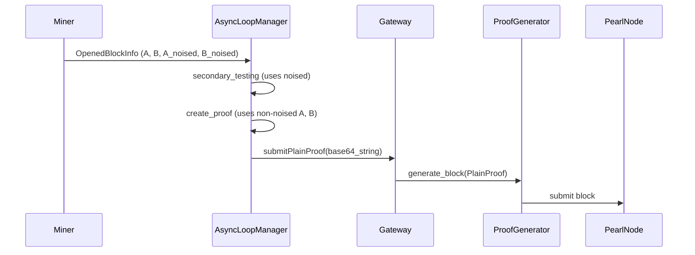

# Pearl Gateway

A lightweight bridge between a Pearl full node and a local Miner process, providing low-latency work distribution and safe submission of candidate blocks.

## Overview

PearlGateway sits between your Pearl node (e.g., pearld) and a local Miner process, exposing a minimal JSON-RPC surface to the Miner while managing the full Pearl Core RPC dialogue internally.

### Features

- Low-latency work distribution via dedicated memory cache
- Safe block submission with full template management
- JSON-RPC interface with validation using JSON Schema
- Support for Unix Domain Socket and TCP communication
- Configurable refresh intervals and authentication

### Architecture

```
                 Miner Process
             (JSON-RPC via UDS/loopback)

          ▲                        ▼
 getMiningInfo              submitPlainProof(PlainProof)
          │                        │
 ┌────────────────────────────────────────────┐
 │             PearlGateway                   │
 │                                            │
 │ ┌────────────┐   ┌───────────────────────┐ │
 │ │ Miner RPC  │──►│      Work Cache       │ │
 │ │  Server    │   └───────────────────────┘ │
 │ └────────────┘               ▲             │
 │         │                    │             │
 │         ▼                    │             │
 │ ┌───────────────────┐  ┌─────────────────┐ │
 │ │  ProofGenerator   │──►│ Submission Svc │ │
 │ └───────────────────┘  └─────────────────┘ │
 └────────────────────────────────────────────┘
           │ getblocktemplate      │ submitblock
           ▼                       ▲
      PearlNode Client (pearld)
```

### Data Flow




### Installation

To install the package from this directory:

```bash
# Standard installation
uv pip install .

# Development installation (includes test dependencies)
uv pip install -e . --group dev
```

The `zk-pow-rust` module will be automatically built and installed from the local `zk-pow` directory.

## Configuration

PearlGateway uses environment variables for configuration with sensible defaults built-in. No configuration file is required.

### Configuration Options

All configuration can be set via environment variables:

**Pearl Node Connection:**
- `PEARLD_RPC_URL` - Pearl node RPC URL
- `PEARLD_RPC_USER` - RPC username (default: `user`)
- `PEARLD_RPC_PASSWORD` - RPC password (default: `pass`)
- `PEARLD_REFRESH_INTERVAL_SECONDS` - Template refresh interval (default: `1`)
- `PEARLD_MINING_ADDRESS` - Taproot address for block rewards (optional, overrides node's mining address)

**Miner RPC Server:**
- `MINER_RPC_TRANSPORT` - Transport type: `uds` or `tcp` (default: `uds`)
- `MINER_RPC_SOCKET_PATH` - Unix socket path (default: `/tmp/pearlgw.sock`)
- `MINER_RPC_PORT` - TCP port for miners (default: `8337`)
- `MINER_RPC_HOST` - TCP host (default: `localhost`)

**Logging:**
- `LOGGING_LEVEL` - Log level: `debug`, `info`, `warning`, `error` (default: `info`)

## Usage

### Starting the Gateway

After installing the package, you can use the `pearl-gateway` command:

```bash
# Start with default configuration
pearl-gateway start

# Start with custom configuration via environment variables
export PEARLD_RPC_URL="https://my-pearl-node:44107"
export PEARLD_RPC_USER="myuser"
export PEARLD_RPC_PASSWORD="mypassword"
export LOGGING_LEVEL="debug"
# Start with a custom mining address (Taproot only)
export PEARLD_MINING_ADDRESS="bc1p5cyxnuxmeuwuvkwfem96lqzszd02n6xdcjrs20cac6yqjjwudpxqkedrcr"
pearl-gateway start

# Enable verbose logging
pearl-gateway start -v
```

### Running Tests

The project uses pytest for testing:

```bash
# Run all tests
pytest
```


